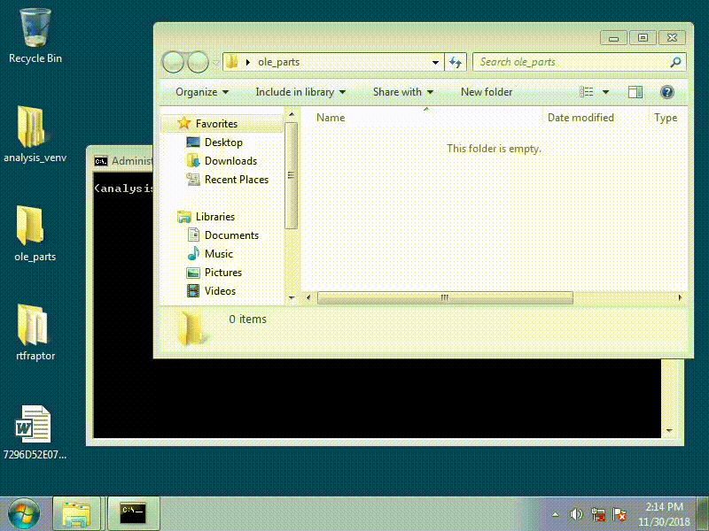

# Introduction

rtfraptor is a simple tool to aid analysis of malicious RTF files by extracting OLEv1 objects.  It was inspired by a 
blog post by Denis O'Brien (link below).

It works by running Word and intercepting calls to OLEv1 functions.  This allows raw OLE objects to be dumped
from memory for further analysis.  The tool is designed to be run on Windows.

This is useful for:

* Avoiding manual analysis of obfuscated RTF files.
* Extracting malicious objects (packager objects, Equation Editor abuse, embedded documents etc.).
* Identifying what vulnerabilities (or features) a RTF document is trying to abuse.
* Verifying the output of other tools (e.g. static document parsers).

The tool was written by [David Cannings](https://twitter.com/edeca) and is released under the AGPL.

# Example



## Installation

Install rtfraptor like so:

    $ pip install rtfraptor

This will automatically fetch and install dependencies.  It is recommended to install in a 
[virtual environment](https://virtualenv.pypa.io/en/latest/userguide/).

## Usage

At minimum the options `--executable` and `--file` need to be passed, like so:

    (analysis_venv) > rtfraptor --executable "C:\Program Files\Microsoft Office\Office15\WINWORD.EXE" --file 7296D52E0713F4BF15CD4E80EF0DA37E.rtf
    
To save JSON output and dump the raw OLEv1 objects to disk, pass the following options:

    --json output.json --save-path ole_parts

**Note:** this tool runs Word.  Analysis of suspicious documents should be done inside a virtual machine.  The tool 
**does not** stop any final payload from executing, and you may wish to isolate the virtual machine from any 
networking. 

## Output

## Raw object output

Raw OLEv1 objects can be stored using the `--save-path` option.  Below is an example Packager object which contains 
a portable executable file.

```
00000000  01 05 00 00 02 00 00 00 08 00 00 00 50 61 63 6b  |............Pack|
00000010  61 67 65 00 00 00 00 00 00 00 00 00 fe 12 00 00  |age.........þ...|
00000020  02 00 63 72 6f 73 73 61 61 61 2e 64 6c 6c 00 43  |..crossaaa.dll.C|
00000030  3a 5c 63 72 6f 73 73 61 61 61 2e 64 6c 6c 00 00  |:\crossaaa.dll..|
00000040  00 03 00 31 00 00 00 43 3a 5c 55 73 65 72 73 5c  |...1...C:\Users\|
00000050  52 65 76 65 72 73 65 5c 41 70 70 44 61 74 61 5c  |Reverse\AppData\|
00000060  4c 6f 63 61 6c 5c 54 65 6d 70 5c 63 72 6f 73 73  |Local\Temp\cross|
00000070  61 61 61 2e 64 6c 6c 00 00 12 00 00 4d 5a 90 00  |aaa.dll.....MZ..|
00000080  03 00 00 00 04 00 00 00 ff ff 00 00 b8 00 00 00  |........ÿÿ..¸...|
00000090  00 00 00 00 40 00 00 00 00 00 00 00 00 00 00 00  |....@...........|
000000a0  00 00 00 00 00 00 00 00 00 00 00 00 00 00 00 00  |................|
000000b0  00 00 00 00 00 00 00 00 d8 00 00 00 0e 1f ba 0e  |........Ø.....º.|
000000c0  00 b4 09 cd 21 b8 01 4c cd 21 54 68 69 73 20 70  |.´.Í!¸.LÍ!This p|
000000d0  72 6f 67 72 61 6d 20 63 61 6e 6e 6f 74 20 62 65  |rogram cannot be|
000000e0  20 72 75 6e 20 69 6e 20 44 4f 53 20 6d 6f 64 65  | run in DOS mode|
... snip ...
```

## Console output

Console output is generated listing any suspicious OLE objects (those in 
[`oletools.common.clsid`](https://github.com/decalage2/oletools/blob/master/oletools/common/clsid.py)):

```
(analysis_venv) > rtfraptor --executable "C:\Program Files\Microsoft Office\Office15\WINWORD.EXE" --file 7296D52E0713F4BF15CD4E80EF0DA37E.rtf --json output.json --save-path ole_parts
WARNING Suspicious OLE object loaded, class id 00020821-0000-0000-C000-000000000046 (Microsoft Excel.Chart.8)
WARNING Object size is 390702, SHA256 is 2a7f92bf37cef77c4fa2e97fcf3478b3e4e4296514817bd8c12e58300b485406
WARNING Suspicious OLE object loaded, class id 00020821-0000-0000-C000-000000000046 (Microsoft Excel.Chart.8)
WARNING Object size is 390190, SHA256 is f8ac5b37f52b6316178c293704fcc762d0a29d2700c7eda53724f552413c7b98
WARNING Suspicious OLE object loaded, class id F20DA720-C02F-11CE-927B-0800095AE340 (OLE Package Object (may contain and run any file))
WARNING Object size is 359115, SHA256 is 2ea248d43d4bd53e234530db0de2517a7f44deba5f43367636232019b2e9e822
WARNING Suspicious OLE object loaded, class id F20DA720-C02F-11CE-927B-0800095AE340 (OLE Package Object (may contain and run any file))
WARNING Object size is 4902, SHA256 is 28c9afbe46a35a6d7115ca3da535854efddc9749f1ff13722fa98d2bd3a8122b
WARNING Suspicious OLE object loaded, class id F20DA720-C02F-11CE-927B-0800095AE340 (OLE Package Object (may contain and run any file))
WARNING Object size is 5926, SHA256 is 5b5850f3217e8465d6add2da18a495d87d33552c6c8f400e52e5ab9cf06ba2e9
WARNING Suspicious OLE object loaded, class id 0002CE02-0000-0000-C000-000000000046 (Microsoft Equation 3.0 (Known Related to CVE-2017-11882 or CVE-2018-0802))
WARNING Object size is 7727, SHA256 is 38d9e74ede4ef67e78e028ecd815c54a777e11c6c4e7838ecbe26fd7e7c03d7c
WARNING Suspicious OLE object loaded, class id 0002CE02-0000-0000-C000-000000000046 (Microsoft Equation 3.0 (Known Related to CVE-2017-11882 or CVE-2018-0802))
WARNING Object size is 7727, SHA256 is a612b7b97f021797c5911cfe02bd9a145f96abb880990830eaf021f98a4a7c8a
```

## JSON output

The tool will produce output in JSON format if the `--json` option is passed.  This can be used for further processing,
and is in the following format:

```
{
  "sha256": "8326bcb300389a2d654e6e921e259e553f33f8949984c2da55ccb6e9ed3f6480",
  "input_file": "7296D52E0713F4BF15CD4E80EF0DA37E.rtf",
  "objects": {
    "0": {
      "class_id": "00020821-0000-0000-C000-000000000046",
      "sha256": "2a7f92bf37cef77c4fa2e97fcf3478b3e4e4296514817bd8c12e58300b485406",
      "description": "Microsoft Excel.Chart.8",
      "size": 390702
    },
    ... snip ...
    "2": {
      "class_id": "F20DA720-C02F-11CE-927B-0800095AE340",
      "sha256": "2ea248d43d4bd53e234530db0de2517a7f44deba5f43367636232019b2e9e822",
      "description": "OLE Package Object (may contain and run any file)",
      "size": 359115
    },
    ... snip ...
    "5": {
      "class_id": "0002CE02-0000-0000-C000-000000000046",
      "sha256": "38d9e74ede4ef67e78e028ecd815c54a777e11c6c4e7838ecbe26fd7e7c03d7c",
      "description": "Microsoft Equation 3.0 (Known Related to CVE-2017-11882 or CVE-2018-0802)",
      "size": 7727
    },
    ... snip ...
}
```

Keys in `objects` are provided in the order the OLEv1 objects were loaded.

# FAQ

## What do I need to make it work?

At minimum you'll need:
 
 * Windows - tested on 7, should work from XP to 10
 * Python 2 - tested on 2.7.15 (32-bit)
 * Word - tested with Office 2013 (32-bit)
 
In theory 64-bit versions of Office and Python should work.  The Python interpreter needs to match Office.

## Why use this instead of `rtfobj`?

Static analysis is clearly preferable in many cases.  However, it's never perfect and emulating a complex parser 
brings a lot of challenges.

Using this tool you are guaranteed to obtain accurate OLEv1 data from Word, after RTF obfuscation has been 
dealt with.  At minimum it proves useful for comparing the output of other tools.

## Does it work with any Microsoft Office program?

In theory yes.  Word, Excel and Powerpoint should all use the same parts of `ole32.dll`.  

However, the current approach is aimed at OLEv1.  This is used by RTF but is considered legacy.  Other formats such as 
Composite Document Format (CDF, as used by `.doc` / `.xls`) and OOXML (as used by `.docx` / `.xslx`) do not typically 
use OLEv1.

## What versions of Office are supported?

This tool was tested with Office 2013.  It should work with any 32-bit desktop version of Office.

It's likely that changes would be required to support 64-bit versions of Office.  If there is significant demand this 
can be investigated further.

## How does it work?

At present the code hooks three functions which are involved in loading an OLEv1 object:

 * `ole32!OleConvertOLESTREAMToIStorage` - which converts legacy OLEv1 objects to an objects implementing `IStorage`.
 * `ole32!OleLoad` - which is called when an OLEv1 object is loaded.
 * `ole32!OleGetAutoConvert` - which is called by `OleLoad` to convert the GUID. 

This chain of functions provides the raw OLEv1 data, confirmation it has been loaded and finally the class identifier.

The method is slightly fragile as `ole32!OleGetAutoConvert` can be called from other (benign) sources.  A better 
approach would be to understand the layout of `IStorage` in memory, which might allow a single hook on `ole32!OleLoad`.

## Can this approach be extended?

Yes.  The primary reason this proof-of-concept has been released is because it can be used in other ways.

For example, it's possible to intercept calls to functions such as `packager!CopyStreamToFile` or parts of Equation 
Editor.  Using this approach you can check function arguments at strategic points to look for invalid data, which 
helps confirm the vulnerability (or feature) being exploited.

You can also catch *all* calls to OLE functions (e.g. `combase!StringFromCLSID`) and compare what a "normal" 
document does versus a malicious one.  Using this method it's possible to spot abuse of legitimate features, use of 
Windows scripting languages, potential exploitation of new vulnerabilities etc.  

But be careful - Office applications make use of COM for lots of legitimate purposes (including activation) so you'll 
need to filter out known good :)

## Can I embed this in my own processing?

Yes.  The tool is a Python module that can be used from within your own code.  

See `rtfraptor.engine` for the core code and `rtfraptor.app` for the example implementation.

## Why only Python 2?

Although I love Python 3, the debugging library used (winappdbg) currently only supports Python 2.

# Known issues

## Safe mode in Word

The target application (typically Word) is forcibly killed after the timeout expires.  This can cause a Safe Mode 
prompt next time the application is started, for example if there is a popup waiting for user input.  

If using the tool manually, raise the timeout and close Word manually.  If operating as part of an automated toolchain, 
consider resetting the virtual machine between runs or deleting the relevant registry keys.

# See also

The following resources are useful:

* The [blog post](http://malwageddon.blogspot.com/2018/11/deobfuscation-tips-rtf-files.html) by 
  [Denis O'Brien](https://twitter.com/Malwageddon) that inspired this tool.
* [rtfobj](https://github.com/decalage2/oletools/wiki/rtfobj), part of oletools by 
  [Decalage](https://twitter.com/decalage2).
* This [Blackhat 2015 presentation](https://www.blackhat.com/docs/us-15/materials/us-15-Li-Attacking-Interoperability-An-OLE-Edition.pdf) 
  on "Attacking Interoperability" by [Haifei Li](https://twitter.com/HaifeiLi).
* The Twitter account for [Mario Vilas](https://twitter.com/Mario_Vilas) who wrote 
  [winappdbg](https://github.com/MarioVilas/winappdbg).